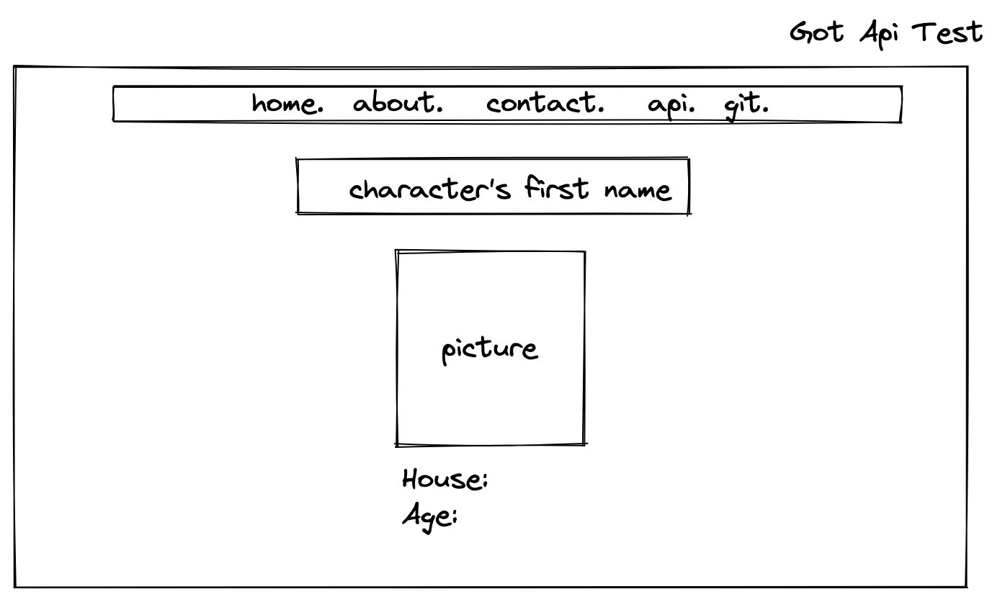

# gotapitest
Testing of a Game of Thrones API.
Should work as follows:
User inputs Character name,
fetch api and return Character "Culture"
Should look as the prototype below that we sketched on Excalidraw
